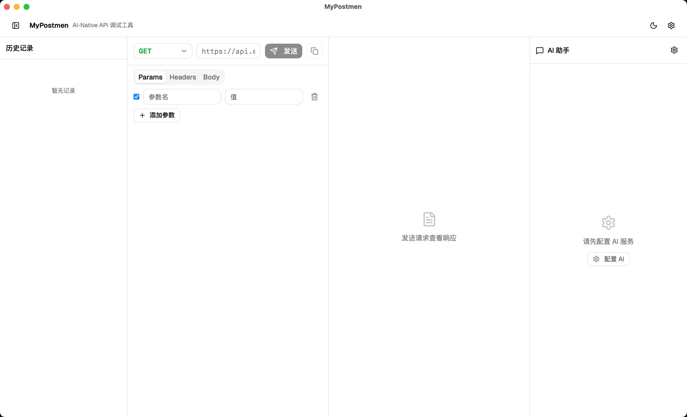

# MyPostmen

轻量级 API 调试工具，支持桌面端（macOS / Windows / Linux）。

## 截图




## 功能

- GET / POST / PUT / DELETE / PATCH 等 HTTP 方法
- 请求头编辑、Raw Body、Form-Data
- 响应查看：状态码、耗时、Headers、Body
- 代码编辑器支持 JSON / XML / HTML 语法高亮
- 内置智能助手，可对请求和响应进行分析（需自行配置后端）
- 请求历史记录，本地持久化存储
- 一键生成 cURL 命令
- 深色 / 浅色主题
- 跨平台桌面端，基于 Tauri 打包

## 技术栈

- React 19 + TypeScript
- Vite 8 + Tauri 2
- Tailwind CSS 4 + shadcn/ui
- Zustand
- CodeMirror 6

## 快速开始

```bash
npm install

# 浏览器开发模式
npm run dev

# 桌面端开发模式
npm run tauri:dev

# 桌面端生产构建
npm run tauri:build
```

桌面端构建需要 Rust 环境，详见 [BUILD.md](./BUILD.md)。

## 配置智能助手

点击右上角设置图标，填入你的后端地址、密钥和模型名称。支持任意 OpenAI 兼容接口。配置保存在本地，不会上传。

## 项目结构

```
src/
├── components/        # 界面组件
│   ├── ui/            # 基础 UI 组件
│   ├── RequestEditor  # 请求编辑器
│   ├── ResponseViewer # 响应查看器
│   ├── AIChatPanel    # 智能助手面板
│   └── HistorySidebar # 历史记录
├── stores/            # 状态管理
└── lib/               # 工具函数（HTTP 客户端、cURL 生成等）
```

## License

MIT
